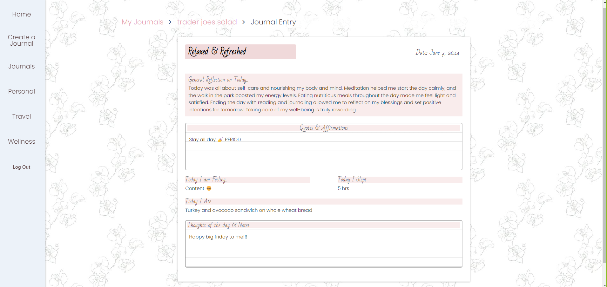

# InsightInk 📓✨

InsightInk is a versatile digital journaling application designed to transform how you capture and reflect on your daily experiences. Whether you're a seasoned journaler or new to the practice, InsightInk offers intuitive features to suit your needs, making journaling accessible and enjoyable.

## Screenshots 📷

## Getting Started 🚀
To start using InsightInk, visit our website: [InsightInk](https://insightink-611-d900faad8907.herokuapp.com/) You can also check out planning and progress on Trello board: [InsightInkTrelloBoard](https://trello.com/b/8EPcG5YL/project-4-glenn-cocos-journal-app)

## Features 🌟
- **Customizable Journals**: Create personalized journals for personal, travel, wellness, and more.
- **Templates**: Choose from a variety of templates to structure your entries effectively.
- **Secure and Private**: Safeguard your thoughts with robust encryption and privacy settings.
- **Daily Lifestyle Insights**:
  - **Mood Tracking**: Monitor your mood fluctuations throughout the day to gain insights into emotional patterns and triggers.
  - **Weather Logging**: Document the weather conditions that influence your mood and daily activities.
  - **Food Input**: Easily input and log the foods you ate or enjoyed each day to keep track of your culinary experiences and preferences.
  - **Sleep Tracker**: Log the hours of sleep you get each night to monitor your sleep patterns and track your restful nights.

## Technologies Used

  

- **Frontend**:
  - HTML5
  - CSS3
  - Materialize CSS

- **Backend**:
  - Python
  - Django
  - Django User Authentication
  - PostgreSQL
  - AWS S3

- **Deployment**:
  - Heroku
  - AWS S3 (for media storage)

## Next Steps 🧠
- Create a customizable template to for personalized journals
- Implement tagging and search functionality for easy content retrieval.
- Integrate reminders and prompts to encourage consistent journaling habits.
- Enhance accessibility features for users with diverse needs.

Join us on InsightInk to embark on a journey of self-discovery and personal growth through the power of digital journaling!